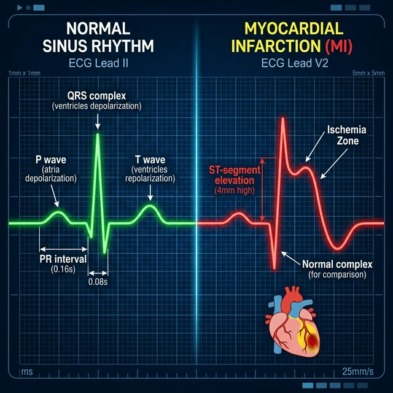

<p align="center">
  
</p>

# 🩺 ECG Myocardial Infarction Detector (MLOps)
> **Relational Data Engineering + Distributed Deep Learning + Enterprise Experiment Tracking**

This repository implements a high-performance **1D-CNN pipeline** designed for the automated detection of **Myocardial Infarction (MI)** from 12-lead ECG signals. Unlike standard notebooks, this project features a specialized **SQL-based Data Engineering layer**, converting clinical SCP-metadata into a queryable structure for complex diagnostic filtering.

---

## 🔬 Background: Clinical Sensitivity vs. Specicity

In acute cardiac care, the cost of a **False Negative** (missing an infarction) far outweighs the cost of a **False Positive** (over-diagnosis). This model is intentionally tuned for **Screening-Oriented Sensitivity**, accepting a higher false-positive rate to ensure that 87% of real MI cases are captured by the automated system. 

The methodology uses the **PTB-XL database**, implementing a **Stratified 10-Fold split** to ensure that diagnostic patterns are learned from diverse patient populations, not just memorized from specific hospital batches.

---

## 🏗️ Architecture & Pipeline

The pipeline follows an industry-standard MLOps lifecycle:

```text
SIGNAL INGESTION        DATA ENGINEERING        DL ARCHITECTURE         MLOPS REGISTRY
PhysioNet / PTB-XL  ──▶  SQLite Metadata  ──▶  4-Block 1D-CNN  ──▶  MLflow Registry 
(Raw .dat Files)      (SQL Diagnostic Map)    (Filter: 32 → 256)      (Best .pth)
```

1.  **Banner/Signal:** Capturing raw 12-lead waveforms at 500Hz.
2.  **ETL Layer:** `src/build_database.py` maps complex SCP-codes (MI, NORM, STTC) to relational tables.
3.  **Neural Engine:** A 4-stage convolutional hierarchy designed to extract temporal rhythms and morphological ischaemic signatures (ST-segment elevation).
4.  **Tracking:** Every experiment logs learning rate, weight decay, and dropout to **MLflow**, ensuring full reproducibility.

---

## 📊 Results Summary (Test Set)

The model was evaluated on **Fold 10** (2,158 unseen clinical exams).

### Performance Metrics
| Metric | Value | Interpretation |
|---|---|---|
| **AUROC** | **0.9242** | Strong separation capacity. |
| **Recall (Sensitivity)** | **86.91%** | 8.7 out of 10 infarction cases correctly flagged. |
| **Specificity** | **80.35%** | Reliable identification of non-MI patients. |
| **Accuracy** | **82.02%** | Overall correct classification rate. |
| **F1-Score** | **71.13%** | Balanced performance on imbalanced cardiac data. |

### Clinical Comparison: MI vs. Normal
<p align="center">
  
</p>
<p align="center">
  <em>Visual representation of ST-segment elevation (STEMI) — the primary morphological feature the 1D-CNN filters are optimized to detect.</em>
</p>

### Confusion Matrix
| | Predicted Normal | Predicted MI |
|---|---|---|
| **Actual Normal** | 1292 (TN) | 316 (FP) |
| **Actual MI** | 72 (FN) | 478 (TP) |

---

## 🛠️ How to Reproduce

### 1. Requirements & Hardware
*   **OS:** Linux / Windows.
*   **GPU:** Recommended (GTX 1650 / RTX Series).
*   **Python:** 3.10+ (Lower versions may conflict with NumPy 2.0).

### 2. Setup
```bash
# Clone and environment
git clone <repo_url>
python -m venv .venv
source .venv/bin/activate

# Install dependencies
pip install -r requirements.txt
```

### 3. Data Ingestion
1.  Download the **PTB-XL** dataset from [PhysioNet](https://physionet.org/content/ptb-xl/1.0.3/).
2.  Place all `.dat`, `.hea` and `ptbxl_database.csv` in `data/raw/`.
3.  Run the ETL pipeline to create the relational database:
    ```bash
    python src/build_database.py
    ```

### 4. Training & Monitoring
```bash
# Start Training
python src/train_mi_detector.py

# Launch MLOps UI in another terminal
mlflow ui
```
*   **Checkpoints:** The best model is saved at `outputs/models/best_mi_detector.pth`.
*   **Logs:** Metrics are stored in the local `mlruns/` directory for visual comparison.

---

## 🔑 Key Differentials (Why this repo?)

*   **Relational Meta-Data:** We don't just load CSVs; we use SQL filtering for robust diagnostic classification.
*   **Clinical Fault Tolerance:** Implements skipping of un-synced/corrupted files (common in OneDrive/Dropbox environments).
*   **Class Weighting:** Uses dynamic `BCEWithLogitsLoss` weights to handle the prevalence of normal ECGs over infarction cases.

---

## 📜 References
- **Wagner, P. (2020).** PTB-XL, a large publicly available electrocardiography dataset. *Scientific Data*.
- **Kiranyaz, S. (2019).** Real-time Patient-specific ECG Classification via 1D Convolutional Neural Networks.
- **MLflow Tracking:** https://mlflow.org/
