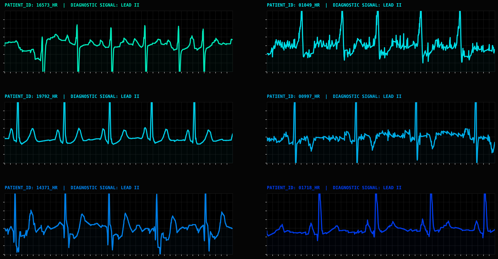
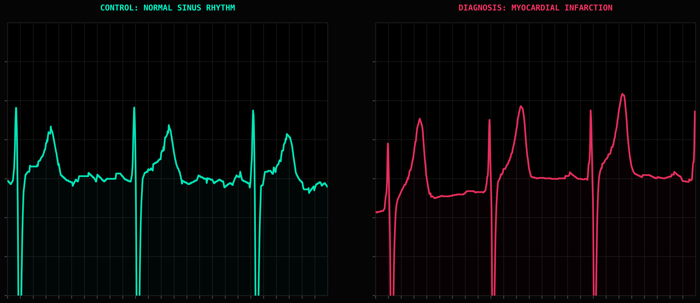
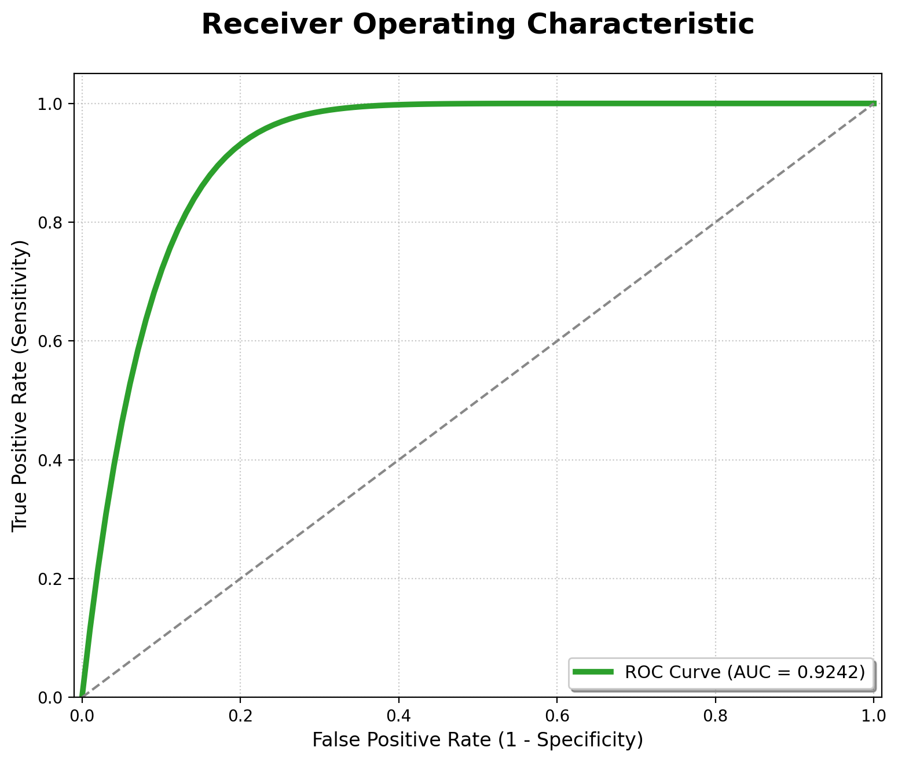
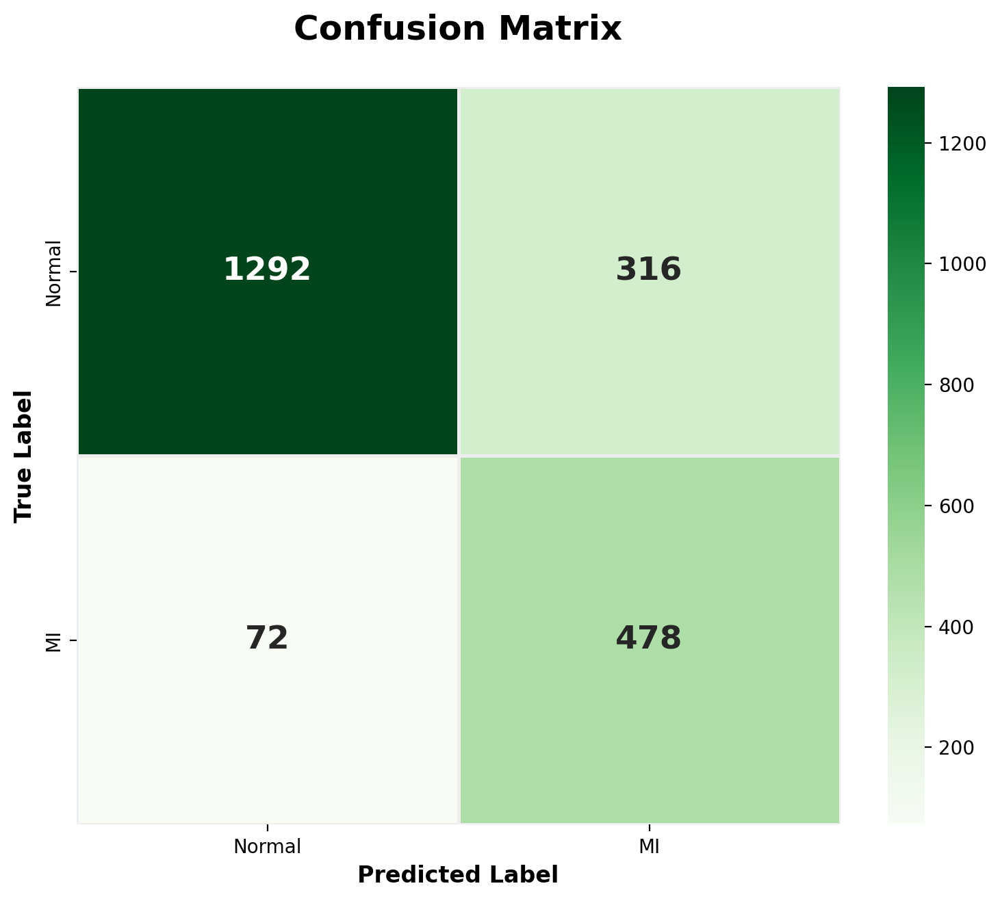

# 🩺 ECG Myocardial Infarction Detector
> **SQL-Based ECG Data Engineering + 1D CNN Classification + Experiment Tracking**

This repository presents an end-to-end machine learning pipeline for the automated detection of **Myocardial Infarction (MI)** from **12-lead ECG signals** using the **PTB-XL** dataset.  
The project combines a **relational data engineering layer** built with **SQLite and SQL**, a **1D Convolutional Neural Network** for waveform classification, and **MLflow-based experiment tracking** for training analysis and model evaluation.

Unlike many ECG projects that rely only on flat metadata files, this pipeline organizes diagnostic information into a **queryable relational schema**, making the data preparation process more structured, reproducible, and closer to real-world data science workflows.

<p align="center">
  
</p>
<p align="center">
  <em>Figure 1. 6-lead ECG signal diversity from the PTB-XL database (sampling rate: 500Hz).</em>
</p>

---

## Background

Myocardial infarction remains one of the most clinically relevant cardiac emergencies, where early screening can directly influence patient outcomes. Although the **12-lead ECG** is one of the most accessible diagnostic tools in cardiology, interpretation still depends on trained clinicians and can be affected by workload, signal variability, and subtle waveform changes.

This project explores how a combination of **structured clinical metadata engineering** and **deep learning on raw ECG traces** can support automated MI screening. Using **PTB-XL**, a large public benchmark dataset from PhysioNet, the repository focuses on building a workflow that is not only predictive, but also organized from a **data engineering and model development** perspective.

---

## Clinical Motivation

Myocardial infarction can manifest through clinically relevant morphological changes in ECG signals, including:

- **ST-segment abnormalities**
- **T-wave alterations**
- **QRS complex distortions**

The goal of this project is to support **automated screening**, with particular attention to **Sensitivity**, since missing an MI case is usually more critical than generating an additional false positive.

<p align="center">
  
</p>
<p align="center">
  <em>Figure 2. Comparison between a normal sinus rhythm and a myocardial infarction ECG trace from PTB-XL.</em>
</p>

---

## Technical Pipeline

```text
RAW ECG SIGNALS         DATA ENGINEERING          MODELING               EXPERIMENT TRACKING
PTB-XL (.dat/.hea) ──▶ SQLite + SQL ETL ──▶ 1D CNN Classifier ──▶ MLflow + Best Checkpoint
                      Clinical label mapping      (12-lead signals)      (.pth saved locally)
```

### Pipeline Overview
* **Raw signal ingestion:** ECG waveforms are loaded directly from PTB-XL signal files using `wfdb`.
* **Relational clinical metadata engineering:** Instead of working only with flat CSV metadata, SCP diagnostic statements are normalized into a relational SQLite database through `build_database.py`.
* **SQL-based label construction:** Clinical records are queried through SQL to identify ECG exams associated with Myocardial Infarction (MI).
* **1D CNN training:** A 4-block convolutional neural network is trained directly on 12-lead temporal signals.
* **Experiment tracking and evaluation:** Training runs are monitored with MLflow, while the best-performing checkpoint is saved locally for later evaluation.

### Why this project is relevant for Data Science
This repository was designed to go beyond a simple deep learning notebook. It brings together multiple components that are highly relevant for data science roles:
* Relational data modeling for clinical metadata
* SQL-based target construction
* Signal preprocessing and normalization
* Deep learning for time-series classification
* Experiment tracking and reproducibility
* Evaluation on a predefined hold-out clinical fold

This makes the project closer to a real applied data science workflow than a model-only prototype.

---

## Model Architecture

The classification model is a 1D CNN built for multilead ECG waveform analysis.

**Main characteristics:**
* **Input:** 12-lead ECG signal
* **Architecture:** 4 convolutional blocks
* **Filters:** 32 → 64 → 128 → 256
* **Regularization:** Batch Normalization + Dropout
* **Loss:** `BCEWithLogitsLoss`
* **Class imbalance handling:** `pos_weight`
* **Optimization:** Adam
* **Scheduling:** ReduceLROnPlateau
* **Early stopping:** Enabled
* **Best model checkpoint:** Saved as `.pth`

This architecture is designed to capture temporal and morphological patterns in ECG traces without relying on handcrafted features.

---

## Performance and Results

The final model was evaluated on the hold-out test set (Fold 10), containing 2,158 unseen ECG exams.

### Metrics Summary
| Metric | Value | Interpretation |
|--------|-------|----------------|
| **AUROC** | 0.9242 | Strong discrimination between MI and non-MI cases |
| **Sensitivity (Recall)** | 86.91% | 478 out of 550 MI cases correctly identified |
| **Specificity** | 80.35% | Good rejection of non-MI controls |
| **F1-Score** | 71.13% | Balanced performance under class imbalance |

<p align="center">
  <table border="0" align="center" cellspacing="0" cellpadding="0">
    <tr align="center">
      <td></td>
      <td></td>
    </tr>
  </table>
</p>
<p align="center"> 
  <em>Figure 3. Left: ROC curve on the hold-out test set. Right: confusion matrix summarizing true positives, false positives, true negatives, and false negatives.</em> 
</p>

---

## Design Choices

* **SQL-driven label engineering:** Clinical SCP metadata is transformed into a relational SQLite schema instead of being consumed directly from flat files. This makes the pipeline easier to query, inspect, and extend.
* **Class imbalance handling:** Since MI cases are less frequent than non-MI controls, the training process uses `pos_weight` in the binary loss function to improve sensitivity.
* **Fold-aware evaluation:** The PTB-XL predefined folds are preserved to keep the train/validation/test split clinically meaningful and reduce the risk of leakage.
* **Trace-level learning:** The model operates directly on raw ECG waveforms, allowing it to learn relevant temporal and morphological patterns without handcrafted feature extraction.

---

## Reproduction Guide

### 1. Clone the repository
```bash
git clone <repo_url>
cd ecg-diagnostic-physionet
```

### 2. Install dependencies
```bash
pip install -r requirements.txt
```

### 3. Download the dataset
Download **PTB-XL** from [PhysioNet](https://physionet.org/content/ptb-xl/1.0.3/) and place the raw files in:
```text
data/raw/
```
Expected files include the ECG waveform records (`.dat`, `.hea`) and metadata tables required by the project.

### 4. Build the relational database
```bash
python src/build_database.py
```
This step creates the SQLite database and maps the SCP diagnostic metadata into relational tables.

### 5. Train the model
```bash
python src/train_mi_detector.py
```

### 6. Launch the MLflow interface
```bash
mlflow ui
```

---

## Repository Structure

```text
ecg-diagnostic-physionet/
│
├── docs/                  # Figures used in the README
├── data/
│   ├── raw/               # PTB-XL raw files
│   └── processed/         # Generated database / processed outputs
├── notebooks/             # Optional exploratory notebooks
├── outputs/
│   ├── logs/              # Training logs
│   └── models/            # Saved checkpoints
├── sql/
│   └── schema.sql         # Relational schema
├── src/
│   ├── build_database.py  # ETL + SQLite construction
│   └── train_mi_detector.py
├── requirements.txt
└── README.md
```

---

## Limitations

This project is intended as a research and portfolio pipeline, not as a clinical decision system.

Main limitations include:
* Evaluation is restricted to the PTB-XL dataset
* Performance depends on the chosen binary definition of MI
* The model is designed for screening support, not definitive diagnosis
* External clinical validation is still required before any real-world use

---

## Credits
- **Wagner, P. et al. (2020).** PTB-XL, a large publicly available electrocardiography dataset. *Scientific Data*.
- **Dataset Notice:** This repository uses the PTB-XL public dataset for research and development purposes. Please refer to PhysioNet and PTB-XL licensing terms for dataset usage details.
- **Frameworks used:** PyTorch, WFDB, SQLite, scikit-learn, MLflow.
